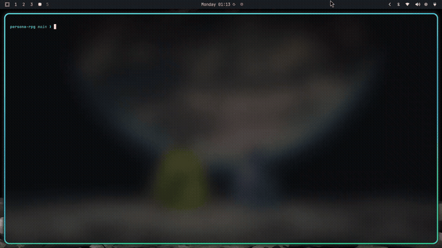

# persona-rpg

[](https://www.rust-lang.org)
[](https://crates.io/crates/crossterm)

A turn-based RPG for the terminal, inspired by **Persona 3 Portable**. Fight shadows in Tartarus, collect Personas, fuse them in the Velvet Room, and survive the Dark Hour.

Un RPG por turnos en la terminal inspirado en Persona 3 Portable. Combate, fusiona Personas y explora la Hora Oscura.

## Demo



¿Prefieres el video completo? [demo.mp4 — 72 s, 1080p](videos/demo.mp4)

## Features

- **5 playable characters** — Makoto, Yukari, Junpei, Akihiko, Mitsuru, each with a signature Persona
- **17 collectible Personas** with their P3 arcana: Orpheus, Jack Frost, Pyro Jack, Pixie, Hua Po...
- **Velvet Room fusion** — combine two Personas (P3 arcana chart, skill inheritance, level math)
- **Shuffle Time** — after every victory, pick one of three cards: a new Persona, HP/MP recovery, or bonus EXP
- **Elemental combat** — 5 elements; hit a weakness for a critical, resist to halve
- **16+ Tartarus shadows** scaled to your level, with weaknesses, resistances, buffs and debuffs
- **ASCII-art sprites**, colored HP/MP bars, and a colored combat log
- **Leveling** — gain EXP, grow stats, up to level 20

## Screenshots

Combat against a Pixie shadow in Tartarus:

```text
┌────────────────────────────────────────────────────────────┐
│   = = =   C O M B A T E   = = =                            │
├────────────────────────────────────────────────────────────┤
│   Pixie Nv.1  (Nv.1)  —  Sombra                            │
│    /\   /\                                                 │
│   ( o ) ( o )       HP [██████████████]  55/55             │
│    \_/   \_/        Débil: Eléctrico  Resiste: Viento      │
│     |  *  |                                                │
│     |     |                                                │
├────────────────────────────────────────────────────────────┤
│   Makoto  (Nv.1)  —  Orpheus                               │
│   \  /\  /                                                 │
│    \/  \/           HP [██████████████]  100/100           │
│    / o  o \         MP [██████████████]  50/50             │
│    \  ^  /          Débil: Eléctrico  Resiste: —           │
│     \__/                                                   │
├────────────────────────────────────────────────────────────┤
│   ── Registro ──                                           │
├────────────────────────────────────────────────────────────┤
│ ¡Comienza el combate!                                      │
├────────────────────────────────────────────────────────────┤
│   ── Acción ──                                             │
├────────────────────────────────────────────────────────────┤
│   > Atacar <                                               │
│     Habilidades                                            │
│     Defender                                               │
│     Huir                                                   │
├────────────────────────────────────────────────────────────┤
│ ↑/↓ mover   Enter elegir   q rendirse                      │
└────────────────────────────────────────────────────────────┘
```

Title screen:

```text
        ______        
     .-'      '-.     
    /   .    .   \    
   |   .      .   |   
   |  .        .  |   
    \   .    .   /    
     '-.______.-'     
┌────────────────────────────────────────────────────────────┐
│                                                            │
│   *  *  *  P E R S O N A   R P G  *  *  *                  │
│                                                            │
│   Un RPG por turnos inspirado en Persona 3                 │
│   La Hora Oscura te espera...                              │
└────────────────────────────────────────────────────────────┘
  Presiona cualquier tecla para comenzar
  o 'q' para salir
```

## Run

```bash
cargo run
```

Requires a terminal with UTF-8 support. Tested on Linux with crossterm.

## Controls

| Context | Key | Action |
|---|---|---|
| Menus | `↑` / `↓` | Move selection |
| Menus | `Enter` | Confirm |
| Exploration | `1` | Advance into Tartarus (random encounter) |
| Exploration | `2` | Rest: recover HP and MP |
| Exploration | `3` | Change Persona (Makoto only) |
| Exploration | `4` | Fusion: Velvet Room (Makoto only) |
| Combat | `↑` / `↓` + `Enter` | Attack, skills, defend, flee |
| Anywhere | `q` | Quit |

## Structure

- `src/main.rs` — entry point, game loop, state machine
- `src/data.rs` — characters, personas, enemies, skills, fusion, shuffle cards
- `src/combat.rs` — turn-based combat, damage, leveling
- `src/ui.rs` — crossterm rendering (title, exploration, combat, shuffle, fusion)

## Tests

```bash
cargo test
```

22 unit tests covering combat, elemental damage, leveling, fusion and shuffle cards.

## Roadmap

- [x] Turn-based combat with elemental weaknesses
- [x] Persona fusion (Velvet Room) and Shuffle Time rewards
- [ ] Tartarus floors with a boss
- [ ] Full moon events
- [ ] Save game
